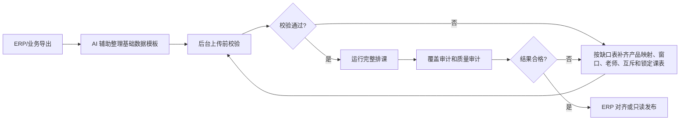

# AI辅助排课系统使用攻略

这份攻略给第一次下载和复用本项目的部门同事使用。目标是让大家在本机跑通“本地数据整理 -> 后台工作台配置 -> 上传前校验 -> 自动排课 -> 质量验收 -> ERP 对齐或只读发布”的完整闭环，并知道如何让 AI 助理参与项目配置、数据处理、规则适配和程序完善。

本系统不是“一键替教务做决定”。它更适合承担三类工作：

- 自动安排上课时间、课程模块顺序、教室、联报班级互斥和老师同日跨教学区通勤质检。
- 把 ERP 导出、历史课表、产品规则、老师安排和教室资源整理成可校验的标准数据。
- 在本部门业务规则和现有程序能力不完全一致时，协助定位差异、调整程序、补充测试和重新验证。

老师安排本身仍需要教务和教学提前规划，例如各班各阶段由哪位老师授课、合班时哪个班级承载实际课表、老师月度课量是否合理。AI 可以整理草稿、发现缺口、生成补录清单和解释报告，但不能替教学和教务做最终决定。

## 0. 先理解系统边界

第一次使用时，不要先研究全部代码。先分清四件事：

| 模块 | 作用 | 谁来维护 |
| --- | --- | --- |
| 数据模板 | 19 张业务表，是正式导入和排课的标准数据；sheet 名和程序字段名不能改 | 教务、运营、数据同事和 AI 助理共同整理 |
| 后台工作台 | 下载模板、导入数据、校验缺口、维护规则、运行排课和查看结果 | 业务同事操作，AI 可协助解释页面和报告 |
| 自动排课程序 | 根据已确认的数据和规则生成课表，并输出审计报告 | 程序执行，AI 可协助排查和改造 |
| 发布复用中心 | 验收后的交付入口，用来看只读课表、排课报告和复用资料 | 项目负责人发布和分享 |

推荐按四轮推进：

1. 环境自检：clone 仓库、安装依赖、跑 `verify_release.sh` 和公开最小示例。
2. 整理模板：用 ERP 导出和人工口径补齐 19 张表，先小范围选 5 到 10 个班级。
3. 预检补录：只跑上传前校验，按报告补产品映射、班级窗口、老师安排、互斥和锁定课表。
4. 正式排课：预检通过后生成课表，跑覆盖审计和质量审计，人工确认后再 ERP 对齐或只读发布。

系统不能自动决定“哪个老师应该教哪个班”。它会根据你确认好的老师、班级窗口、产品规则、教室资源和互斥关系，自动安排上课时间、课程顺序和教室，并在报告中暴露缺口和质量风险。

## 1. 本地安装和自检

项目已经发布到 GitHub：

```text
https://github.com/zhimagege520-hub/kaoyan_paike
```

先安装 Python 3.11 或更高版本，然后在项目目录执行：

```bash
git clone https://github.com/zhimagege520-hub/kaoyan_paike.git
cd kaoyan_paike
python3 -m pip install -r requirements.txt
bash scripts/verify_release.sh
```

启动后台工作台：

```bash
./scripts/start_admin.sh
```

打开浏览器访问：

```text
http://127.0.0.1:8765
```


如果 8765 端口被占用，可以换端口：

```bash
PORT=8766 ./scripts/start_admin.sh
```

也可以先用公开最小 CSV 示例验证命令行闭环：

```bash
python3 run_scheduling_pipeline.py --source examples/csv_minimal --data-dir /tmp/ai_schedule_demo_data --output-dir /tmp/ai_schedule_demo_outputs --preflight
python3 run_scheduling_pipeline.py --source examples/csv_minimal --data-dir /tmp/ai_schedule_demo_data --output-dir /tmp/ai_schedule_demo_outputs
```

`verify_release.sh` 会自动跑脚本语法检查、全部 Python 脚本编译、CLI 入口 `--help` 冒烟检查、发布包内容审计、单元测试、核心 JSON 样例、公开最小 CSV 示例、覆盖审计和质量审计。公开示例只排一个班级的一次 4 小时课程，用来证明本机环境、模板读取、预检、正式排课、CSV/HTML 输出都正常。

如果让 AI 助理代跑，建议把 GitHub 链接、本部门 ERP 导出的 Excel/CSV、这份攻略一起给它。要求 AI 先跑 `verify_release.sh` 和公开最小示例，再处理真实数据；不要一开始就让它改规则或正式排课。

给 AI 助理的安装提示词：

```text
请在本机下载并运行这个 AI 辅助排课系统。先安装依赖，执行 bash scripts/verify_release.sh，再用 examples/csv_minimal 跑一次预检和正式排课。请不要修改业务规则，也不要处理真实数据，先确认环境、测试和公开示例都能通过。
```

公开示例排通只说明本机环境和程序链路正常；真实数据还必须通过上传前校验。首次导入本部门数据时，如果预检被“缺老师安排、缺产品映射、班级窗口缺边界、无可用课节”等问题拦住，这是正常的数据补齐流程，不代表程序坏了。处理顺序建议是：先补 ERP 产品对应，再补班级窗口和教师安排，最后检查互斥关系、锁定课表和全局停课日期。

## 2. 如何让 AI 助理参与项目

AI 助理适合做“整理、校验、解释、改造”，不适合替业务负责人做未确认的判断。建议每次给 AI 一个清晰任务，并要求它输出可检查的文件、命令和验证结果。

### 2.1 材料包

给 AI 助理的材料包建议一次性准备好：

| 材料 | 用途 | 注意事项 |
| --- | --- | --- |
| GitHub 仓库链接 | 下载项目、安装依赖、启动后台 | 先跑 `verify_release.sh`，再处理真实数据 |
| 本部门 ERP 导出 | 整理教学区、教室、教师、班级、ERP 标准产品、历史课表和锁定课表 | 保留原始文件，不要直接覆盖 |
| 本部门产品和排课规则说明 | 生成产品管理、产品课程课时和产品窗口规则 | 产品规则用季节窗口，班级窗口再按年份展开 |
| 人工确认清单 | 补老师、合班、互斥、全局停课、特殊教室 | AI 可以整理草稿，但不能替教学和教务做最终决定 |
| 本攻略 | 约束 AI 的处理顺序和验收口径 | 要求先预检，缺口只生成补录清单，不要猜老师或跳过硬规则 |

不要把 Cookie、Token、API Key、密码、验证码、身份证号、银行卡、私密联系方式放进提示词。真实业务数据只在本机处理，不要让 AI 把 `data/`、`outputs/`、`.env` 或包含敏感信息的文件提交到 GitHub。

### 2.2 推荐协作方式

| 阶段 | 可以让 AI 做什么 | 必须人工确认什么 |
| --- | --- | --- |
| 环境配置 | 安装依赖、启动后台、跑公开示例、解释报错 | 本机权限、端口、Python 版本是否符合部门环境 |
| 数据整理 | 读取 ERP 导出，生成或修正 19 张模板表，统一日期、ID、名称和备注 | 哪些资源真实可排，哪些产品和班级属于本轮范围 |
| 规则整理 | 把产品规则翻译成产品窗口规则、课程课时、班级排课窗口 | 产品规则是否准确，老师安排和合班关系是否已确认 |
| 上传前校验 | 跑 `--preflight`，解释报告，生成补录清单 | 缺口项的最终业务答案 |
| 程序适配 | 判断现有字段和规则是否能承接本地需求，必要时改代码和补测试 | 业务新规则是否长期有效，是否需要进入标准模板 |
| 质量验收 | 跑覆盖审计、质量审计，汇总风险和调整建议 | 是否接受质量风险，是否需要人工调整或重排 |

### 2.3 标准提示词

处理本部门 ERP 导出的提示词：

```text
我会提供本部门 ERP 导出的教学区、教室、教师、班级、ERP 标准产品和历史课表文件。请先阅读 AI辅助排课系统使用攻略，然后按当前模板字段整理数据。不要改 sheet 名和程序字段名；无法确认的内容请生成待确认清单，不要猜。整理完成后请运行上传前校验，并说明阻塞项和对应补录位置。
```

整理产品和排课规则的提示词：

```text
请把我提供的产品规则整理到产品管理表、产品课程课时表和产品窗口排课规则表。产品层只维护寒假、春季、暑假、秋季这类季节窗口；具体班级的年度窗口、日期、时段、教学区和教室放到班级排课窗口表。若现有字段无法表达某条规则，请先说明差异和建议方案，再决定是否改程序。
```

处理预检缺口的提示词：

```text
请根据 run_scheduling_pipeline.py --preflight 生成的报告和缺口 CSV，判断每个阻塞项应该回填到哪张表。请只生成补录清单和建议，不要擅自猜老师，不要跳过硬约束，不要直接正式排课。
```

让 AI 调整程序的提示词：

```text
本部门有一条长期有效的新排课规则，当前模板或程序无法完整表达。请先判断是否能通过现有 19 张表配置实现；如果不能，请提出最小的数据结构和程序调整方案，说明会影响哪些表、后台页面、排课器、导入脚本和测试。修改后必须运行相关单元测试和 bash scripts/verify_release.sh，并给出验证结果。
```

### 2.4 程序调整的工作顺序

当本部门业务和产品规则需要改程序时，建议让 AI 按下面顺序做：

1. 先确认新规则是否可以通过现有表配置解决，例如产品窗口规则、班级排课窗口、教师不可排日期时段、互斥组或锁定课表。
2. 如果必须改程序，先写清楚新规则的输入字段、输出影响和验收标准。
3. 同步修改模板表、后台页面、导入同步脚本、排课器和报告，不只改其中一处。
4. 为新规则补单元测试、静态守卫或公开最小样例，避免后续复用时又退回旧逻辑。
5. 运行相关测试和 `bash scripts/verify_release.sh`。
6. 不提交真实 `data/`、`outputs/` 和本地环境文件，只提交程序、文档、示例和测试。

程序改造完成后的合格标准：

| 检查项 | 合格标准 |
| --- | --- |
| 模板一致 | Excel/CSV 模板字段、后台字段、导入脚本和排课器字段一致 |
| 页面可维护 | 后台能查看和编辑新增规则，不需要手改 JSON |
| 预检能拦截 | 缺字段、缺规则、日期时段不成对等问题能在正式排课前暴露 |
| 排课能执行 | 新规则参与候选课节生成、冲突判断或质量审计 |
| 测试能覆盖 | 单元测试和发布门禁能防止同类问题回归 |

## 3. 工作流总览



日常使用优先进入“排课运行维护”页，按“填写模板 -> 校验数据 -> 生成课表 -> 查看结果”推进。


后台左侧按工作流分组：

| 分组 | 页面 | 用途 |
| --- | --- | --- |
| 全局时间 | 年度窗口与课节 | 维护年度窗口、课节明细、全局停课日期 |
| 基础资源 | 教学区与教室、教学区通勤关系、教师基础信息、教师不可排时间 | 维护可用资源、容量、通勤距离、老师不可排例外 |
| 产品规则 | 产品管理、ERP产品对应、产品课程课时、产品窗口规则 | 维护产品、课程模块、季节窗口规则、ERP 标准产品映射 |
| 班级需求 | 班级基础信息、班级排课窗口、班级老师安排、班级互斥关系 | 维护每个班级实际窗口、场地、老师和联报互斥 |
| 控制交付 | 锁定课表、排课运行维护、发布复用中心 | 固定不可移动课表，执行排课、核对报告、只读分享和复用资料 |

第一次复用时建议先选 5 到 10 个班级跑小闭环。小闭环能验证本部门的产品命名、ERP 产品对应、老师安排、教室资源和窗口规则是否能跑通，确认没问题后再扩大到完整批次。

## 4. 数据模板怎么填

正式模板以后台当前数据框架为准，共 19 张业务表。每张表第 5 行是中文字段名，第 6 行是程序字段名，数据从第 7 行开始；不要改 sheet 名和第 6 行字段名。

不要把模板、报告和结果混作同一类文件：

| 文件类型 | 作用 | 是否回填到后台 |
| --- | --- | --- |
| Excel 模板或 CSV 模板包 | 标准业务数据，补齐后重新上传 | 是 |
| 预检报告和缺口 CSV | 告诉你缺什么，例如缺老师、缺产品映射、缺窗口 | 不是直接结果；按提示补回模板 |
| 排课 CSV 和 HTML | 已生成课表，用于核对、ERP 对齐和只读发布 | 不是基础模板；需要调整时回到对应业务表修改 |

数据来源分三类处理：

- ERP 导出后交给 AI 整理：教学区、教室、教师、班级、ERP 标准产品、历史课表和锁定课表。
- 人工先定口径再填写：年度窗口、全局停课、产品窗口规则、班级窗口边界、教师不可排时间、班级老师安排、互斥组。
- 后台或程序自动生成后人工核对：课节表、班级排课窗口、缺老师补录表、排课结果 CSV、覆盖审计和质量审计报告。

ERP 导出建议先按下面方式拆给 AI 整理，再人工核对：

| ERP 或业务来源 | 主要落表 | AI 可以做什么 | 人工必须核对什么 |
| --- | --- | --- | --- |
| 教学区导出 | `03_教学区表` | 剔除咨询点，识别住宿、停用、废弃资源，保留可追溯备注 | 哪些教学区本轮真的可排 |
| 教室导出 | `04_教室表` | 识别废弃/停用教室，补所属教学区、容量、教室类型 | 容量是否真实可用，线上虚拟教室是否单独维护 |
| 教师导出 | `05_教师基础信息表` | 统一教师 ID、姓名、项目、主授科目、用工类型 | 全职/兼职、在职状态、可授科目是否准确 |
| ERP 标准产品导出 | `19_ERP标准产品清单`、`18_ERP产品对应表` | 按课程编码和版本整理标准产品，并尝试匹配本地产品 | 本地产品是否匹配正确的 ERP 课程和版本 |
| 班级查询导出 | `10_班级基础信息表`、`11_班级排课窗口表` | 按 ERP 产品对应归类班级，结合开结课日期生成年度窗口草稿 | 每个班每个窗口的日期、时段、场地和教室锁定 |
| 历史已排课明细 | `17_历史已排课明细表` | 抵扣已上课时、学习老师安排、识别合班候选 | 历史数据是否属于本轮应抵扣范围 |
| 已固定课表 | `14_锁定课表` | 转成不可移动课表，占用老师、教室和互斥资源 | 哪些课真的不能移动，字段是否能回写 ERP |

填写时先守住三条规则：

- 产品层只维护季节窗口规则，班级层才维护带年份的实际排课窗口。
- 日期和时段要成对填写。`start_period` 必须有 `start_date`，`end_period` 必须有 `end_date`，`first_lesson_period` 必须有 `first_lesson_date`；只填时段会在上传前校验阶段被拦截。
- 缺老师补录表不是另一套新数据。把 `missing_class_teacher_assignments_*.csv` 中补齐的老师 ID、老师姓名和合班课表方式，回填或合并到 `12_班级老师安排表` 后重新上传。

| 顺序 | 表 | 主要来源 | 填写重点 |
| --- | --- | --- | --- |
| 01 | 年度排课窗口表 | 人工维护或后台新增 | 用 `2026暑假`、`2026秋季` 这类“年度+窗口”管理实际排课窗口；默认寒假 1-2 月、春季 3-6 月、暑假 7-8 月、秋季 9-12 月；新增年份后可批量生成课节 |
| 02 | 课节表 | 后台按年度窗口批量生成 | 维护日期、星期、上午/下午/晚上、是否可用和不可排原因；生成后按窗口默认规则锁定不可排日，再补人工停课说明 |
| 03 | 教学区表 | ERP 教学区导出后整理 | 剔除咨询点；住宿、停用、废弃资源保留追溯但不可排 |
| 04 | 教室表 | ERP 教室导出后整理 | 保留教室 ID、所属教学区、容量、教室类型、启用状态 |
| 05 | 教师基础信息表 | ERP 全职教师和班课兼职教师导出 | 维护员工 ID、姓名、主授科目、教师角色、用工类型和在职状态 |
| 06 | 教师不可排日期时段表 | 人工补充 | 只填不可排例外：兼职限制、请假、培训、会议；同一老师可多条 |
| 07 | 产品管理表 | 本地产品口径 | 用本地产品 ID 管理要排课的产品，推荐命名为“项目+子产品+课程性质+科目”，例如 `考研无忧春_正课_数学` |
| 08 | 产品课程课时表 | 历史课表、产品方案、人工核对 | 维护阶段、阶段优先级、课程组、模块优先级、课程编码、课程名称和总课时；可以让 AI 从历史课表先整理草稿再人工核对 |
| 09 | 产品窗口排课规则表 | 人工按产品规则整理 | 按产品+季节窗口维护可排星期、时段、单次课时、每日/每周上下限和同半天连续块 |
| 10 | 班级基础信息表 | ERP 班级查询导出后整理 | 维护班级、产品、考季、人数、实际开结课日期和默认场地 |
| 11 | 班级排课窗口表 | 由班级日期和产品窗口生成后人工核对 | 逐班逐年度窗口维护最早/最晚可排日期、时段、教学区、教室和是否锁定指定教室；寒暑营、无忧寒等跨窗口资源差异放这里 |
| 12 | 班级老师安排表 | 教务和教学人工确认 | 按班级、科目、阶段、课程组维护老师；合班时填写实际排课班级 |
| 13 | 班级排课互斥关系表 | 套班编码、联报关系、人工补充 | 维护不能在同一课节上课的班级组 |
| 14 | 锁定课表 | 已排固定课表导出 | 记录不能移动的课，排其他班时要避开这些资源占用 |
| 15 | 教学区通勤关系表 | 地址/经纬度、高德距离、人工判断 | 记录教学区之间距离和打车时长，标记跨区通勤风险，用于质量审计和调整 |
| 16 | 全局停课日期表 | 节假日、中心活动、集中调休 | 所有产品和班级都不能排课的日期，排课时自动避开 |
| 17 | 历史已排课明细表 | ERP 已排课表导出 | 用于抵扣已上课时、学习老师安排和识别合班候选 |
| 18 | ERP产品对应表 | 本地产品和 ERP 标准产品匹配 | 把本地排课产品关联到 ERP 课程编码和版本 |
| 19 | ERP标准产品清单 | ERP 课程产品管理导出 | 作为 ERP 产品对应的只读参考清单 |

最容易卡住排课的表是：`09_产品窗口排课规则表`、`11_班级排课窗口表`、`12_班级老师安排表`、`13_班级排课互斥关系表`、`14_锁定课表`、`18_ERP产品对应表`。

## 5. 三类关键规则

### 产品窗口规则

产品规则只写寒假、春季、暑假、秋季这类季节窗口，不写具体年份。例子：

| 产品窗口 | 填写方式 |
| --- | --- |
| 寒暑营正课英语，寒假 | 周一到周六白天；每次 4 小时、2 节；固定同一半天、同一老师；每日上限 8 小时；每周上下限按业务确认填写 |
| 寒暑营正课英语，春季 | 周二到周六晚上；每次 2 小时、1 节；每日上限 2 小时 |
| 无忧秋，暑假 | 周一到周六白天；每天不超过 4 小时 |

如果白天一次排 4 小时、2 节课，规则里要开启同半天连续块；程序会把两节放在同一上午或同一下午，避免上午一节加下午一节。

### 班级排课窗口

班级窗口按具体年份展开。无忧秋这类跨两个秋季的班级，要分别维护 `2026秋季` 和 `2027秋季`；寒暑营、无忧寒这类寒假和暑假面授可能在不同教学区上课，也在本表按窗口分别维护场地。

例如某寒暑营班级可以这样拆：寒假 `2027寒假` 在新华公学固定教室上课；春季 `2027春季` 在线上虚拟教室上课；暑假 `2027暑假` 在南亚理工固定教室上课；秋季 `2027秋季` 再回到线上虚拟教室。每一段都写成一行班级窗口记录，程序按具体窗口读取日期、时段和场地。

班级排课窗口回答四个问题：

- 这个班在这个年度窗口是否纳入本轮排课。
- 最早从哪天、哪个时段开始排。
- 最晚到哪天、哪个时段结束。
- 这个窗口使用哪些教学区和教室，是否必须使用指定教室。

### 老师、互斥和锁定课表

- 老师安排按 `班级 + 科目 + 阶段 + 课程组` 维护，不靠班级名称猜老师。
- 合班共享课表时，一个班级是实际排课班级，其他班共享它对应课次的时间、老师和教室。
- 教师不可排日期时段只记录例外，全职老师默认可排；全职请假也填在这里。
- 互斥组用于联报学生群体，组内班级不能同课节上课。
- 锁定课表用于已经人工排好且不能移动的课，后续自动排课会避开。

## 6. 上传前校验

后台操作：

1. 打开“排课运行维护”。
2. 上传原始导出、填写后的 Excel 模板或 CSV 模板包。
3. 点击“执行校验”。
4. 按报告和缺口文件补齐数据。

命令行操作：

```bash
python3 run_scheduling_pipeline.py --source incoming --preflight
```

校验通过才进入正式排课。校验未通过时不要强行排课，先处理报告里的阻塞项。

判断问题归属时可以按下面三层看：

- 环境问题：`verify_release.sh` 或公开最小示例失败，先修 Python 版本、依赖、端口或文件权限。
- 模板结构问题：上传模板后字段缺失、sheet 名识别失败、日期格式错误，先重新下载后台模板或让 AI 按当前字段修表。
- 业务数据缺口：程序能生成预检报告和缺口 CSV，但提示缺老师、缺映射、缺窗口或无可用课节，按报告补齐后重新预检。

| 结果 | 处理方式 |
| --- | --- |
| 缺老师安排 | 下载 `missing_class_teacher_assignments_*.csv`，补齐老师后重新上传 |
| 缺产品映射 | 在 ERP 产品对应页补齐本地产品和 ERP 标准课程产品关系 |
| 日期和时段不成对 | 回到班级基础信息或班级排课窗口页，补齐对应日期，或清空不需要的时段 |
| 无可用课节 | 检查课节表 `is_usable`、全局停课日期、产品窗口规则和班级排课窗口 |
| 教室不可用或容量为 0 | 回到教学区与教室页核对启用状态、容量和班级窗口里的教室选择 |
| 班级窗口缺边界 | 回到班级排课窗口页补齐最早/最晚日期时段和窗口场地 |

## 7. 正式排课

预检通过后，再执行完整排课：

```bash
python3 run_scheduling_pipeline.py --source incoming
```

后台运行时会自动生成：

- `data/scheduler_input_draft.json`：排课器实际输入。
- `outputs/schedule_<timestamp>.csv`：排课明细。
- `outputs/schedule_<timestamp>.html`：可视化课表。
- `outputs/import_report_<timestamp>.md`：导入和排课报告。
- `outputs/backups/`：正式运行前的数据备份。

核心排课器也可以单独验证：

```bash
python3 scheduler.py \
  --input examples/input_example.json \
  --output /tmp/schedule.csv \
  --html-output /tmp/schedule.html
```

## 8. 排课结果质量检查

排课成功不等于可以发布。至少检查这些信号：

| 检查项 | 合格标准 |
| --- | --- |
| 不撞车 | 同一老师、班级、教室、互斥组没有同课节冲突 |
| 不漏课 | 每个进入排课范围的班级需求课时都被覆盖 |
| 日期合理 | 每个班只排在自己的班级排课窗口内 |
| 规则合理 | 产品可排星期、时段、每日上限、同半天连续块规则被执行 |
| 能交付 | CSV 可核对，HTML 可阅读，报告说明清楚 |

可执行的审计命令：

```bash
python3 scripts/audit_schedule_coverage.py \
  --data-dir data \
  --schedule-csv outputs/schedule_<timestamp>.csv \
  --out-dir outputs \
  --timestamp <timestamp>

python3 scripts/audit_schedule_quality.py \
  --data-dir data \
  --schedule-csv outputs/schedule_<timestamp>.csv \
  --out-dir outputs \
  --timestamp <timestamp>
```

覆盖审计用于看课时是否排足；质量审计用于看周课量、同日负载、老师跨教学区移动等体验问题。硬冲突和覆盖缺口必须处理，质量问题按优先级处理或说明原因。

## 9. ERP 对齐和只读发布

ERP 回写前，先确认 `18_ERP产品对应表` 已经把本地产品关联到 ERP 课程编码和版本；否则课程 ID、课程名称和版本无法稳定回写。

如果要回写 ERP，先确认本部门系统使用哪一种导入方式：

1. 如果 ERP 支持按排课结果直接导入，就用 `outputs/schedule_<timestamp>.csv` 对齐课次 ID、日期、时间、班级编码、教师 ID、教室 ID、课程 ID。
2. 如果 ERP 需要先生成空白课次，再按课次 ID 回写，先从“课次梳理/课表导入”页面下载待排课班级的空白课表模板；必要时把空白课表日期整体临时后移，导入系统生成可回写课次；再根据班级编码和课次 ID，把程序排课结果写回导入模板。
3. 回写前核对 `18_ERP产品对应表` 和 `19_ERP标准产品清单`，确保本地产品能稳定对应 ERP 课程编码、版本和课程名称。

ERP 回写字段对照：

| 排课结果字段 | ERP 导入常见字段 | 核对重点 |
| --- | --- | --- |
| `class_id` | 班级编码 | 必须和 ERP 空白课次所属班级一致 |
| `date`、`start_time`、`end_time` | 上课日期、开始时间、结束时间 | 日期不能落在全局停课、班级窗口外或不可用课节 |
| `teacher_id`、`teacher_name` | 教师1、实际授课教师 ID、教师姓名 | 教师 ID 优先；姓名只做人工核对 |
| `room_id`、`room_name` | 教室 ID、教室名称 | 固定教室班级不能被替换；走读班级可按同教学区可用教室调整 |
| `course_code`、`course_name` | 课程 ID、课程编码、课程名称 | 依赖 `18_ERP产品对应表` 和产品课程课时表 |
| `slot_ids` 或课次顺序 | 课次 ID | 如 ERP 要求按课次 ID 回写，先建立班级编码+课次 ID 的对应关系 |

只读发布用于给同事查看结果，不开放后台保存、导入和排课接口。

本地生成登录密码哈希：

```bash
python3 schedule_publish_server.py --hash-password
```

本地预览：

```bash
export SCHEDULE_VIEWER_USERNAME="schedule-viewer"
export SCHEDULE_VIEWER_PASSWORD_HASH="上一步生成的哈希"
export SCHEDULE_VIEWER_SECRET_KEY="$(python3 -c 'import secrets; print(secrets.token_urlsafe(48))')"
PORT=8780 ./scripts/start_schedule_publish.sh
```

访问：

```text
http://127.0.0.1:8780/schedule
```

## 10. GitHub 下载复用建议

其他部门 clone 后推荐顺序：

```bash
git clone https://github.com/zhimagege520-hub/kaoyan_paike.git
cd kaoyan_paike
python3 -m pip install -r requirements.txt
bash scripts/verify_release.sh
./scripts/start_admin.sh
```

仓库里包含程序、后台页面、脚本、公开示例、测试和文档；不包含本部门真实 `data/` 数据、`outputs/` 历史输出、`.env`、密码、Cookie、Token、API Key。

使用 AI 助理协作时，可以把仓库链接、本攻略和本部门导出的 Excel/CSV 一起提供给助理，让它按以下顺序处理：先识别本部门产品和班级口径，再生成或修正模板表，然后执行上传前校验，最后根据报告逐项补齐。不要让 AI 直接猜老师安排、强行放宽硬规则或跳过人工质检。

给 AI 助理的完整复用提示词：

```text
请下载并运行这个 AI 辅助排课系统。先按 README 跑通 verify_release.sh 和 examples/csv_minimal，再根据我提供的 ERP 导出整理 19 张模板表。正式排课前必须先做上传前校验；如出现缺老师、缺产品映射、无可用课节等问题，只生成补录清单和说明，不要擅自猜测老师或跳过硬约束。如果本部门业务规则无法用现有模板表达，请先说明差异、建议的数据结构和程序调整方案，再补测试并运行 verify_release.sh。
```

## 11. 问题排查

| 现象 | 优先检查 |
| --- | --- |
| 端口打不开 | 终端是否还在运行、端口是否被占用、是否改用 `PORT=8766` |
| 上传后没有排课结果 | 是否只做了预检，或预检报告是否有阻塞项 |
| 课表缺很多课 | 产品课程课时、班级适用阶段、历史课表扣减、班级窗口是否正确 |
| 老师冲突多 | 教师不可排时间、合班共享课表、锁定课表是否维护准确 |
| 教室不对 | 班级排课窗口里的教学区/教室是否覆盖了班级默认教室 |
| 报告打开乱码或不可读 | 在后台“发布复用中心”打开报告预览页；原始 Markdown 仍可下载 |
| AI 改完程序后排课异常 | 先看是否同步改了模板、后台、导入脚本、排课器和测试；再跑 `bash scripts/verify_release.sh` |

每次修改基础数据后，建议先跑 `--preflight`，再正式排课。每次修改程序后，建议先跑相关单元测试，再跑 `bash scripts/verify_release.sh`。
